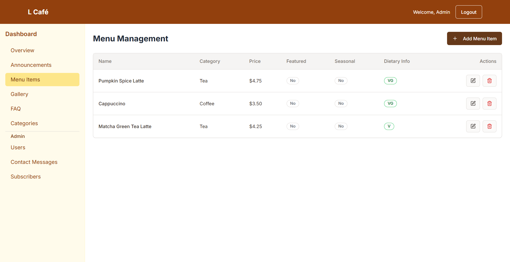
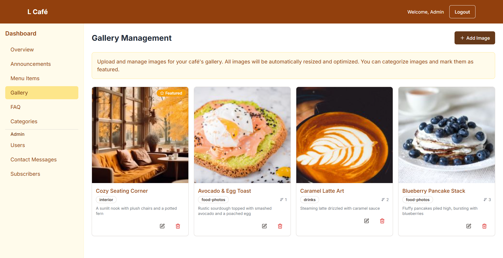

# L Café - Daily Grind

A modern, full-stack café management system built with React, TypeScript, and Node.js. This comprehensive web application provides both a customer-facing website and a powerful administrative dashboard for managing all aspects of a café business.

## 🌟 Features

### Customer-Facing Website
- **Modern Landing Page** - Responsive design with hero section, about, and featured content
- **Interactive Menu** - Dynamic menu display with categories, pricing, and availability
- **Gallery** - Image showcase with organized categories
- **Announcements** - Latest news and updates from the café
- **Contact System** - Contact form with Google Maps integration
- **FAQ Section** - Frequently asked questions with search functionality
- **Real-time Visitor Count** - Live visitor tracking using Socket.IO

### Administrative Dashboard
- **Role-Based Access Control** - Admin, Staff, and Customer roles with different permissions
- **Content Management** - Full CRUD operations for menu, gallery, announcements, and FAQ
- **User Management** - Admin-only user account management
- **Contact Management** - View and manage customer inquiries
- **Subscriber Management** - Email subscription management
- **Analytics** - Visitor tracking and engagement metrics
- **Real-time Updates** - Live data synchronization across all connected clients

### Security Features
- **JWT Authentication** - Secure token-based authentication
- **CSRF Protection** - Cross-site request forgery protection
- **Input Validation** - Comprehensive server-side validation
- **Role-based Authorization** - Granular permission system
- **Secure File Upload** - Image processing with Sharp
- **Rate Limiting** - API endpoint protection

## 🛠️ Tech Stack

### Frontend
- **React 18** - Modern React with hooks and functional components
- **TypeScript** - Type-safe development
- **Vite** - Fast build tool and development server
- **Tailwind CSS** - Utility-first CSS framework
- **Shadcn/ui** - Modern UI component library
- **React Router** - Client-side routing
- **React Query** - Server state management
- **Socket.IO Client** - Real-time communication
- **React Hook Form** - Form handling with validation
- **Zod** - Schema validation

### Backend
- **Node.js** - JavaScript runtime
- **Express.js** - Web application framework
- **MongoDB** - NoSQL database
- **Mongoose** - MongoDB object modeling
- **Socket.IO** - Real-time bidirectional communication
- **JWT** - JSON Web Token authentication
- **bcrypt** - Password hashing
- **Multer** - File upload handling
- **Sharp** - Image processing
- **Helmet** - Security middleware

## 📁 Project Structure

```
daily-grind/
├── src/                          # Frontend source code
│   ├── components/              # Reusable React components
│   │   ├── ui/                 # Shadcn/ui components
│   │   └── dashboard/          # Admin dashboard components
│   ├── pages/                  # Page components
│   ├── contexts/               # React contexts (Auth, Socket)
│   ├── services/               # API service functions
│   ├── hooks/                  # Custom React hooks
│   └── lib/                    # Utility functions
├── backend/                     # Backend source code
│   ├── controllers/            # Route controllers
│   ├── models/                 # Mongoose models
│   ├── routes/                 # Express routes
│   ├── middleware/             # Custom middleware
│   ├── config/                 # Configuration files
│   └── public/                 # Static files and uploads
├── mdFiles/                    # Documentation files
└── public/                     # Frontend static assets
```

## 🚀 Getting Started

### Prerequisites
- Node.js (v18 or higher)
- MongoDB (local or cloud instance)
- npm or yarn package manager

### Installation

1. **Clone the repository**
   ```bash
   git clone https://github.com/Ahmed-Sedki/daily-grind-cafe-website.git
   cd daily-grind
   ```

2. **Install frontend dependencies**
   ```bash
   npm install
   ```

3. **Install backend dependencies**
   ```bash
   cd backend
   npm install
   cd ..
   ```

4. **Environment Configuration**
   
   Create `.env` file in the backend directory:
   ```env
   # Database
   MONGODB_URI=mongodb://localhost:27017/lcafe
   
   # Authentication
   JWT_SECRET=your-super-secret-jwt-key
   
   # Server
   PORT=5000
   NODE_ENV=development
   
   # File Upload
   MAX_FILE_SIZE=5242880
   UPLOAD_PATH=./public/uploads
   ```

5. **Database Setup**
   ```bash
   cd backend
   npm run seed  # Optional: Seed initial data
   ```

### Development

1. **Start the backend server**
   ```bash
   cd backend
   npm run dev  # Runs on http://localhost:5000
   ```

2. **Start the frontend development server**
   ```bash
   npm run dev  # Runs on http://localhost:8080
   ```

3. **Access the application**
   - Frontend: http://localhost:8080
   - Backend API: http://localhost:5000
   - Admin Dashboard: http://localhost:8080/dashboard

### Production Build

1. **Build the frontend**
   ```bash
   npm run build
   ```

2. **Start the production server**
   ```bash
   cd backend
   npm start
   ```

## 📚 API Documentation

### Authentication Endpoints
- `POST /api/auth/login` - User login
- `POST /api/auth/register` - User registration
- `POST /api/auth/logout` - User logout
- `GET /api/auth/me` - Get current user

### Content Management
- `GET /api/announcements` - Get announcements
- `POST /api/announcements` - Create announcement (Auth required)
- `PUT /api/announcements/:id` - Update announcement (Auth required)
- `DELETE /api/announcements/:id` - Delete announcement (Auth required)

### Menu Management
- `GET /api/menu` - Get menu items
- `POST /api/menu` - Create menu item (Auth required)
- `PUT /api/menu/:id` - Update menu item (Auth required)
- `DELETE /api/menu/:id` - Delete menu item (Auth required)

### User Management (Admin only)
- `GET /api/users` - Get all users
- `PUT /api/users/:id/role` - Update user role
- `DELETE /api/users/:id` - Delete user

## 🔐 User Roles

### Admin
- Full system access
- User management
- All content management
- System analytics
- Settings configuration

### Staff
- Content management (announcements, menu, gallery, FAQ)
- View dashboard statistics
- Manage customer inquiries
- Limited user profile access

### Customer
- Public website access
- Profile management
- No administrative access

## 🎨 UI Components

The project uses Shadcn/ui components for a consistent, modern design:
- Forms with validation
- Data tables with sorting and filtering
- Modal dialogs
- Toast notifications
- Loading states
- Responsive navigation

## 📱 Responsive Design

- Mobile-first approach
- Responsive breakpoints for all screen sizes
- Touch-friendly interface
- Optimized images and assets

## 🔧 Development Scripts

```bash
# Frontend
npm run dev          # Start development server
npm run build        # Build for production
npm run preview      # Preview production build
npm run lint         # Run ESLint

# Backend
npm run dev          # Start with nodemon
npm start            # Start production server
npm run seed         # Seed database with initial data
```

## 🤝 Contributing

1. Fork the repository
2. Create a feature branch (`git checkout -b feature/amazing-feature`)
3. Commit your changes (`git commit -m 'Add some amazing feature'`)
4. Push to the branch (`git push origin feature/amazing-feature`)
5. Open a Pull Request

## 📄 Screenshots

### Landing Page & Main Features
<div align="center">
  
  <p><em>Modern landing page with hero section and navigation</em></p>
</div>

<div align="center">
  
  <p><em>About section showcasing café information</em></p>
</div>

<div align="center">
  
  <p><em>Interactive menu with categories and pricing</em></p>
</div>

### Gallery & Content
<div align="center">
  
  <p><em>Image gallery with organized categories</em></p>
</div>

<div align="center">
  
  <p><em>Latest announcements and news</em></p>
</div>

<div align="center">
  
</div>

### Administrative Dashboard
<div align="center">
  
  <p><em>Administrative dashboard overview</em></p>
</div>

<div align="center">
  
  <p><em>User management interface</em></p>
</div>

<div align="center">
  
  <p><em>Content management system</em></p>
</div>

### Menu & Gallery Management
<div align="center">
  
  <p><em>Menu item management interface</em></p>
</div>

<div align="center">
  
  <p><em>Gallery management system</em></p>
</div>

<div align="center">
  
  <p><em>Announcements management interface</em></p>
</div>

### FAQ & Contact Management
<div align="center">
  
  <p><em>FAQ management system</em></p>
</div>

<div align="center">
  
  <p><em>Contact inquiries management</em></p>
</div>

<div align="center">
  
  <p><em>Email subscriber management</em></p>
</div>

### Authentication & Security
<div align="center">
  
  <p><em>Secure login interface</em></p>
</div>

<div align="center">
  
  <p><em>User registration system</em></p>
</div>

<div align="center">
  
  <p><em>User profile management</em></p>
</div>

## 🙏 Acknowledgments

- [Shadcn/ui](https://ui.shadcn.com/) for the beautiful UI components
- [Tailwind CSS](https://tailwindcss.com/) for the utility-first CSS framework
- [React](https://reactjs.org/) for the powerful frontend library
- [Express.js](https://expressjs.com/) for the robust backend framework
